## Machine Learning Fine Tuner
Fine-tune and optimize your machine learning models effortlessly. It provides a user-friendly interface for tuning various parameters, selecting the best algorithms, and enhancing model performance. Whether you're a beginner or an experienced data scientist, It empowers you to unlock the full potential of your predictive models with ease.


### Overview
The Machine Learning Fine Tuner is a Streamlit web application designed to streamline the process of building, training, and fine-tuning machine learning models. It allows users to upload preprocessed CSV datasets, select dependent and independent features, choose from a variety of machine learning algorithms, and make predictions using the trained models.


### Screenshots
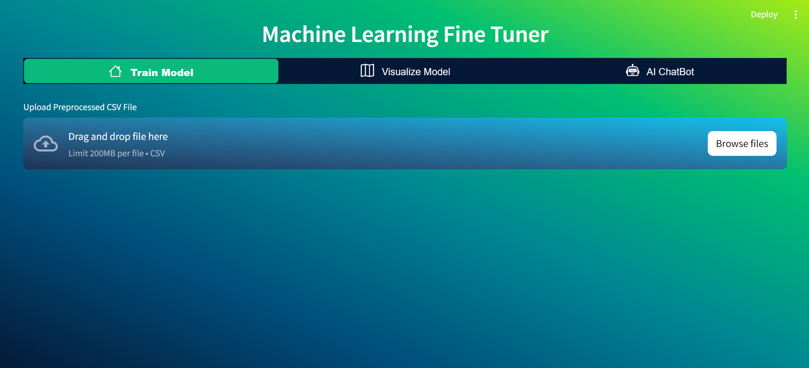
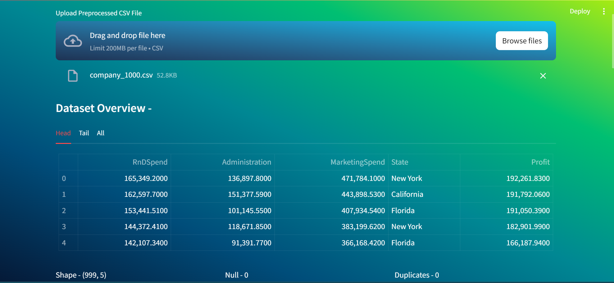
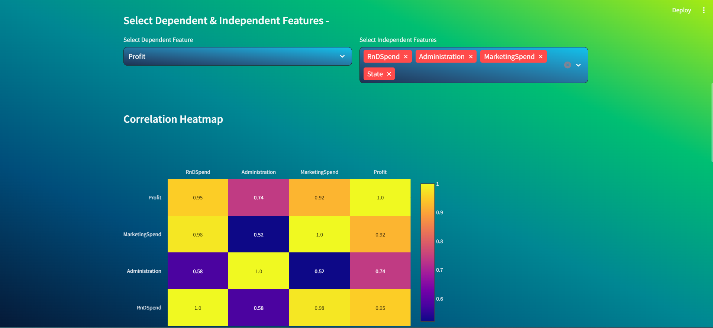
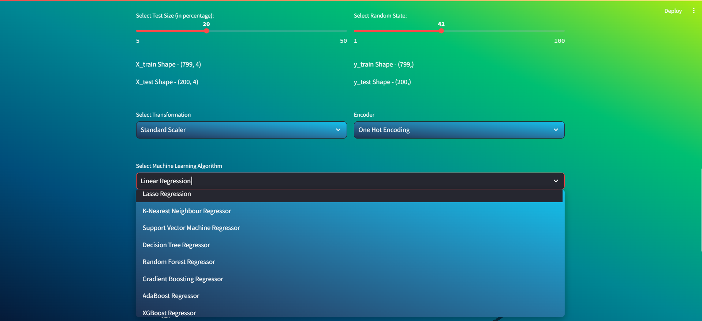
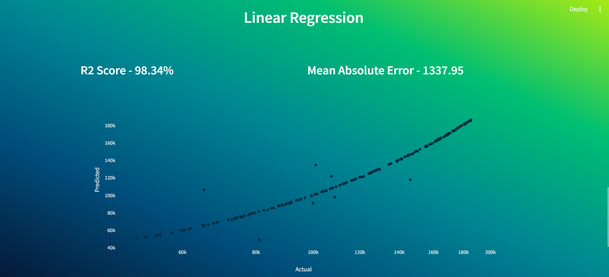
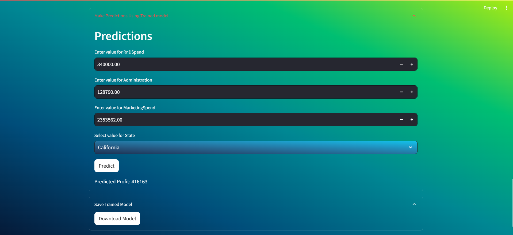
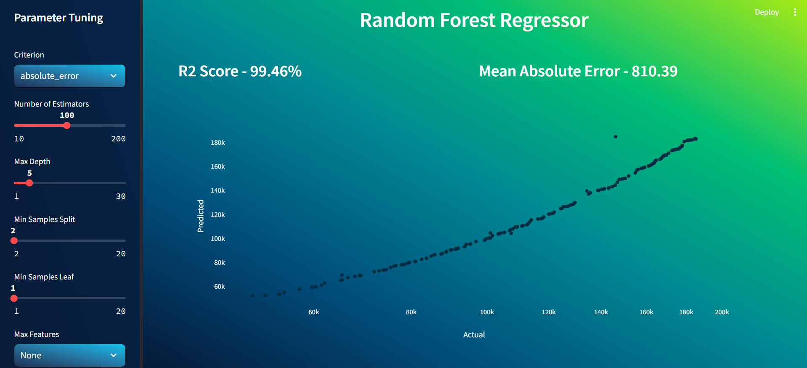
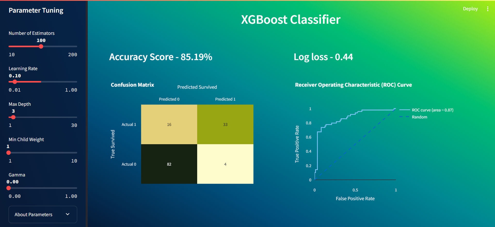
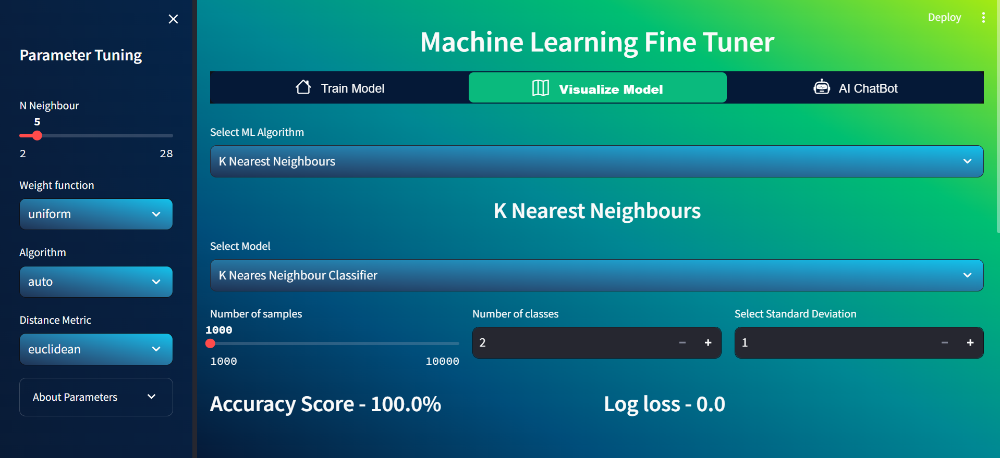
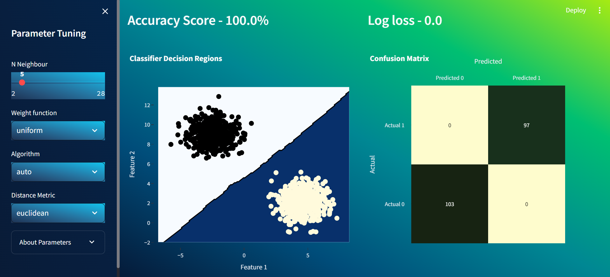
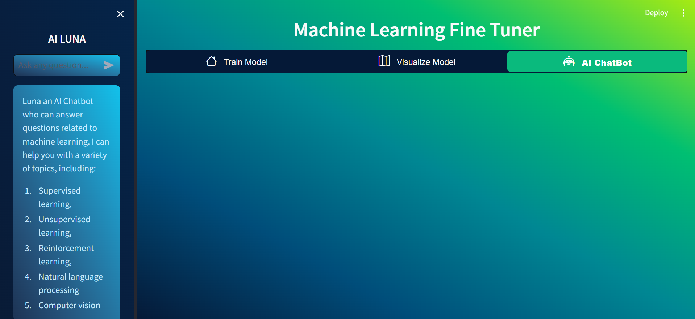
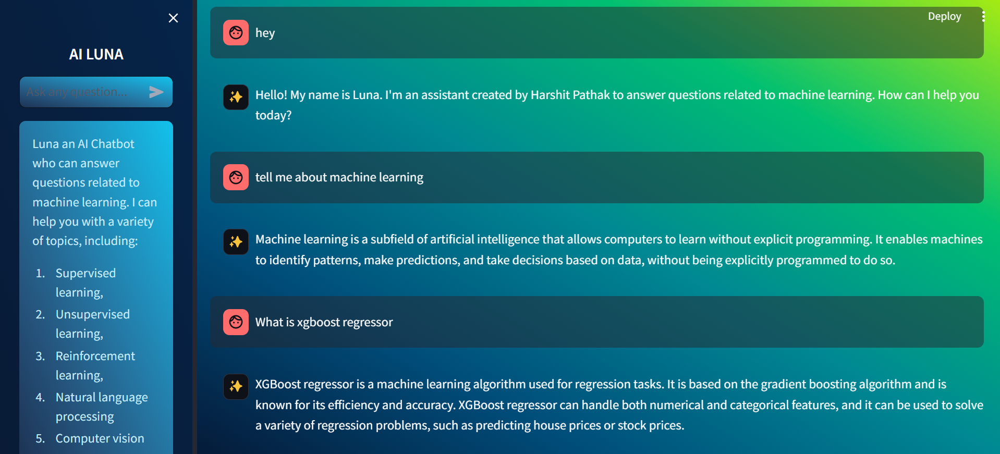

### LinkedIn Demo Video
[https://www.linkedin.com/posts/harshitpathak18_machinelearning-datascience-modeldevelopment-activity-7181559439185903616-Zv0z?utm_source=share&utm_medium=member_desktop]

### Features
- **Dataset Overview:** View the head, tail, and summary statistics of the uploaded dataset.
- **Feature Selection:** Select dependent and independent features from the dataset.
- **Correlation Matrix:** Visualize the correlation between numerical features using an interactive heatmap.
- **Data Splitting:** Split the dataset into training and testing sets with customizable test size and random state.
- **Preprocessing:** Apply scaling and encoding transformations to the dataset.
- **Model Selection:** Choose from a range of classification and regression algorithms, including Logistic Regression, K-Nearest Neighbors, Support Vector Machines, Decision Trees, Random Forests, Gradient Boosting, AdaBoost, and XGBoost.
- **Model Evaluation:** Evaluate the performance of the selected machine learning algorithm using various metrics such as accuracy, precision, recall, F1-score, and RMSE.
- **Model Deployment:** Save the trained model and download it for future use.

### Usage
1. **Upload Data:** Upload a preprocessed CSV file containing the dataset.
2. **Select Features:** Choose the dependent and independent features for the analysis.
3. **Explore Data:** View the dataset overview, correlation matrix, and summary statistics.
4. **Split Data:** Customize the test size and random state for splitting the data into training and testing sets.
5. **Preprocess Data:** Apply scaling and encoding transformations to the dataset.
6. **Select Algorithm:** Choose the desired machine learning algorithm for training the model.
7. **Make Predictions:** Use the trained model to make predictions on new data.
8. **Save Model:** Save the trained model and download it for future use.

### Technologies Used
- Python
- Streamlit
- Pandas
- Scikit-learn
- Plotly

### Installation
1. Clone the repository:

```
git clone https://github.com/your_username/machine-learning-fine-tuner.git
```

2. Install the required dependencies:

```
pip install -r requirements.txt
```

3. Run the Streamlit app:

```
streamlit run app.py
```

#### Contributors
- [Harshit Pathak](https://github.com/harshitpathak18)

Feel free to customize and expand upon this description according to your project's specific features and requirements.
